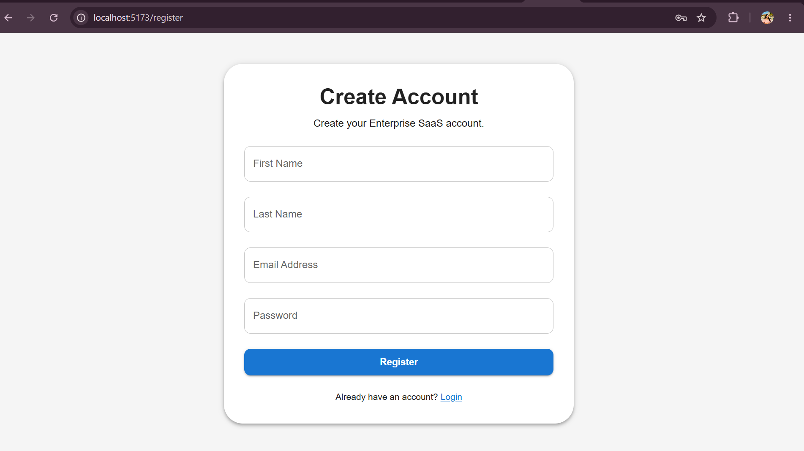
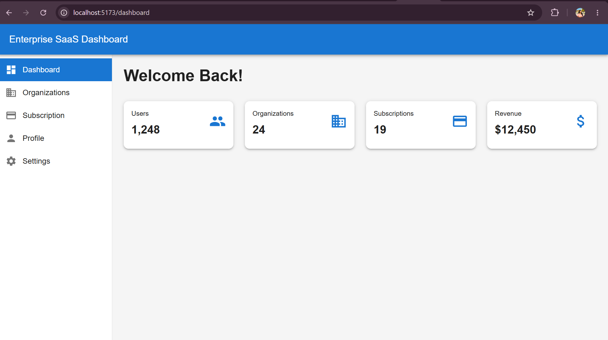
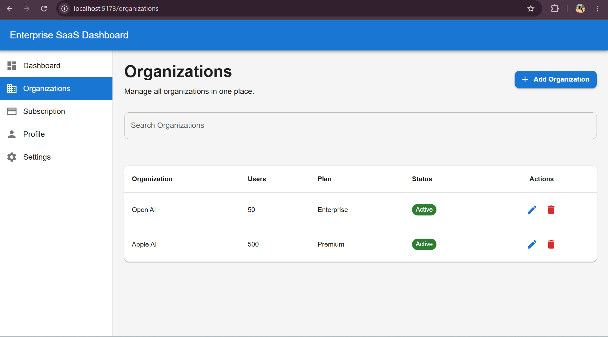
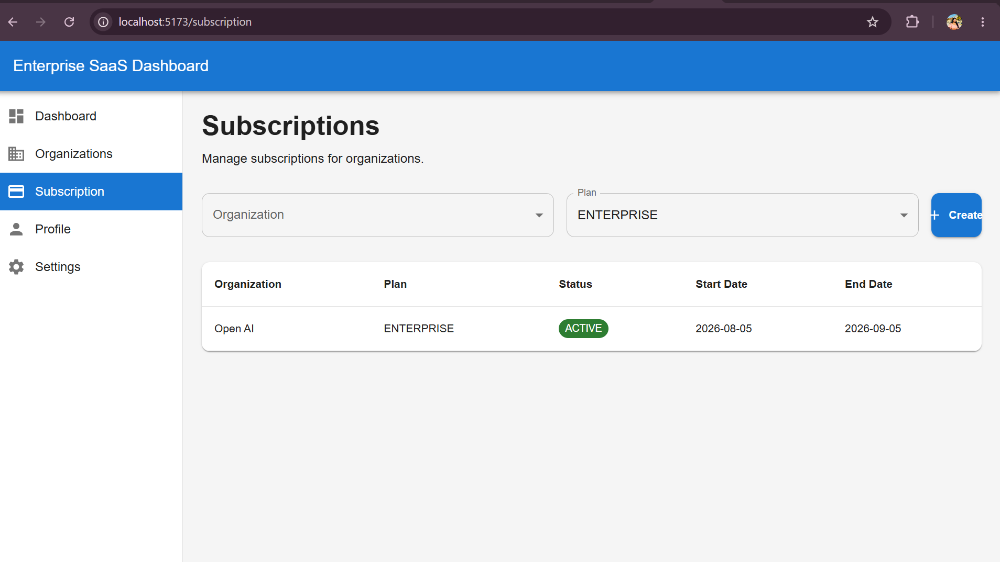

# 🚀 Enterprise SaaS Platform

A production-ready Full Stack Enterprise SaaS Platform built with **Java 21, Spring Boot, React, TypeScript, PostgreSQL, JWT Authentication, and Stripe Integration**.

This project demonstrates enterprise software development practices including secure authentication, RESTful APIs, layered architecture, responsive frontend design, and subscription management.

---

# ✨ Features

## 🔐 Authentication

- User Registration
- Secure Login
- JWT Authentication
- Password Encryption using BCrypt
- Protected REST APIs

## 🏢 Organization Management

- Create Organizations
- View Organizations
- Update Organizations
- Delete Organizations
- Search Organizations

## 💳 Subscription Management

- Create Subscription
- View Active Subscriptions
- Organization Subscription Mapping
- Plan Management

## 💰 Stripe Integration

- Stripe Customer Creation
- Checkout Session Integration
- Payment Ready Architecture

## 📊 Dashboard

- Responsive Dashboard
- Enterprise UI
- Material UI Components
- Statistics Cards

---

# 🛠 Technology Stack

## Backend

- Java 21
- Spring Boot 3
- Spring Security
- Spring Data JPA
- Hibernate
- JWT Authentication
- Maven

## Frontend

- React 19
- TypeScript
- Material UI
- React Router
- Axios

## Database

- PostgreSQL

## Cloud & DevOps

- Docker
- AWS Ready
- Git
- GitHub

## Payment

- Stripe API

## Documentation

- Swagger / OpenAPI

---

# 🏗 Architecture

```
React + TypeScript
        │
        ▼
Spring Boot REST APIs
        │
        ▼
Spring Security + JWT
        │
        ▼
Business Service Layer
        │
        ▼
Spring Data JPA
        │
        ▼
PostgreSQL
        │
        ▼
Stripe API
```

---

# 📁 Project Structure

```
enterprise-saas-platform
│
├── backend
│   ├── Controllers
│   ├── Services
│   ├── Repositories
│   ├── Entities
│   ├── Security
│   └── Configuration
│
├── frontend
│   ├── Pages
│   ├── Components
│   ├── Layouts
│   ├── API
│   └── Context
│
└── README.md
```

---

## 📸 Screenshots

### Login


### Register



### Dashboard



### Organizations



### Subscription


---

# 🔌 REST API

## Authentication

- POST /api/v1/auth/register
- POST /api/v1/auth/login

## Organizations

- GET /api/v1/organizations
- POST /api/v1/organizations
- PUT /api/v1/organizations/{id}
- DELETE /api/v1/organizations/{id}

## Subscriptions

- GET /api/v1/subscriptions
- POST /api/v1/subscriptions

---

# 🚀 Getting Started

## Backend

```bash
mvn spring-boot:run
```

## Frontend

```bash
npm install
npm run dev
```

---

# 🌟 Future Enhancements

- Email Verification
- Password Reset
- Role-Based Access Control (RBAC)
- Multi-Tenant Support
- AI-Powered Analytics Dashboard
- AI Chat Assistant using Spring AI
- OpenAI Integration
- Retrieval-Augmented Generation (RAG)
- Kubernetes Deployment
- CI/CD Pipeline

---

# 👨‍💻 Author

**Lakshmi Padmavathi Devara**

- GitHub: https://github.com/Lakshmi068
- LinkedIn: https://www.linkedin.com/in/lakshmipadmavathi/

---

⭐ If you found this project useful, consider giving it a star!
